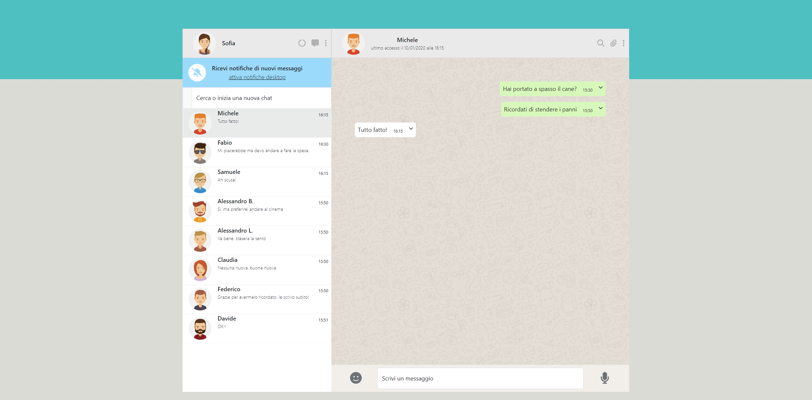

<h3 align="center">WhatsApp replica</h3>
<div align="center">

<p>A basic replica of Whatsapp</p>
</div>

<!-- ABOUT THE PROJECT -->
## About The Project


This is a basic replica of whatsapp in layout and functions, built with  and 

This replica currently allows you to:

* send messages while receiving a standard automatic response
* view the contact's last login, which updates dynamically
* delete messages from the chat
* search for contacts by name

<!-- GETTING STARTED -->
## Getting Started

### Installation

1. Clone the repo
   ```sh
   git clone https://github.com/mazzocchifrancesco/rep_whatsapp.git
   ```
2. Install NPM packages
   ```sh
   npm install
   ```